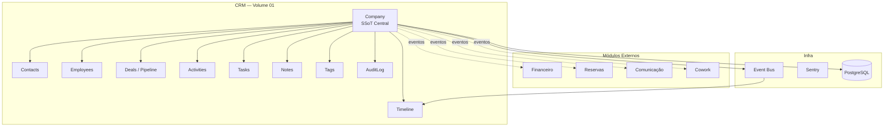

# Volume 01 — CRM · Índice Mestre

> **Versão:** 1.0.0-draft  
> **Estado:** 📝 Em elaboração — Aguarda aprovação do Product Owner  
> **Aprovação Formal:** Encerramento Fase P0 — 28 Julho 2026  
> **Autor:** Claude (Arquiteto-Chefe VD Platform)  
> **Revisão:** Ernesto Pinto Luciano (Product Owner)  
> **Idioma:** Português (Angola)  
> **Implementação:** ⛔ BLOQUEADA até Executive Summary aprovado

---

## Declaração de Escopo

O Volume 01 transforma o VD Platform num **CRM centrado na Empresa (Company)** como única fonte de verdade.  
Todo Lead, Contacto, Interação, Documento e Evento financeiro pertence a uma Empresa.  
Não existe cliente sem empresa. Não existe historial sem rastreabilidade.

---

## CRM Maturity Level

Este volume implementa o **Nível L2 — Customer 360° Integrado** do CRM Maturity Roadmap:

| Nível | Designação | Volume | Estado |
|---|---|---|---|
| **L1** | CRM Operacional Básico | Pre-existente (parcial) | ✅ Base existente |
| **L2** | Customer 360° Integrado | **Vol. 01** | 📝 **Em especificação** |
| **L3** | Automação Comercial | Vol. 02 | 📋 Planeado |
| **L4** | CRM Inteligente / Analytics / IA | Vol. 03 | 📋 Planeado |

---

## Regras Obrigatórias (invioláveis)

Estas regras foram aprovadas pelo Product Owner e aplicam-se a **toda** a implementação do CRM:

```
1. COMPANY COMO SSoT
   → A Company é a entidade central. Toda entidade referencia uma Company.
   → Não existe Lead, Contact, Employee, Deal ou Documento sem Company associada.

2. LEAD É UM ESTADO, NÃO UMA ENTIDADE SEPARADA
   → Lead é um atributo de status de um Company ou Contact no funil comercial.
   → A conversão Lead → Cliente não duplica dados — apenas altera o estado.

3. SEM DUPLICAÇÃO DE ENTIDADES
   → Cada empresa existe exactamente uma vez no sistema.
   → Cada contacto existe exactamente uma vez por empresa.
   → Merge obrigatório ao detectar duplicados.

4. TODA INTERAÇÃO GERA TIMELINE
   → Qualquer acção relevante (chamada, email, reunião, proposta, pagamento) 
     cria automaticamente um registo na Timeline da Company.

5. TODA ALTERAÇÃO GERA AUDITORIA
   → Qualquer modificação a entidades críticas é registada em AuditLog com:
     userId, timestamp, campo, valor anterior, valor novo.

6. TODO EVENTO É PUBLICADO NO EVENT BUS
   → Nenhum módulo acede directamente ao estado de outro módulo.
   → A comunicação é sempre assíncrona via eventos.

7. TODA COMUNICAÇÃO FICA ASSOCIADA À EMPRESA
   → Emails, chamadas, reuniões, propostas — todos ligados à Company.

8. TODO FLUXO DEVE SER REVERSÍVEL E RASTREÁVEL
   → Não existem operações destrutivas sem confirmação e log.
   → O sistema deve suportar "desfazer" estados no funil.

9. SEGURANÇA NÃO REGRIDE
   → Nenhuma feature do CRM pode reduzir os níveis de segurança alcançados na P0.
   → RBAC, auditoria e rate limiting mantêm-se intactos.

10. TESTES PRIMEIRO
    → Cobertura ≥ 60% mantida. Novos módulos críticos exigem testes antes do merge.
```

---

## Índice de Documentos — Volume 01

### Fase de Modelação (obrigatória antes de qualquer código)

| # | Documento | Descrição | Estado |
|---|---|---|---|
| 01 | [customer360.md](./customer360.md) | Customer 360°, Company como SSoT, relações entre entidades | 📝 Em elaboração |
| 02 | [data-model.md](./data-model.md) | Schema completo, ERD, enums, índices, regras de integridade | 📝 Em elaboração |
| 03 | [pipeline.md](./pipeline.md) | Pipeline CRM, Kanban, estados do funil, Lead Lifecycle | 📝 Em elaboração |
| 04 | [events.md](./events.md) | Event Catalog CRM: 30+ eventos, payloads, handlers, Timeline | 📝 Em elaboração |
| 05 | [api.md](./api.md) | 50+ endpoints REST, métodos, payloads, códigos de erro | 📝 Em elaboração |
| 06 | [permissions.md](./permissions.md) | Matriz RBAC por role × recurso × acção | 📝 Em elaboração |
| 07 | [ux.md](./ux.md) | UX Flows, wireframes funcionais, navegação, estados de UI | 📝 Em elaboração |
| 08 | [testing.md](./testing.md) | Estratégia de testes CRM: unitários, integração, e2e | 📝 Em elaboração |
| 09 | [migration.md](./migration.md) | Plano de migração dos dados actuais para o novo modelo | 📝 Em elaboração |

### Decisões Arquitecturais (ADRs)

| ADR | Decisão | Estado |
|---|---|---|
| ADR-016 | Company como entidade central do CRM (SSoT) | 📝 Em elaboração |
| ADR-017 | Lead como estado de Company, não entidade independente | 📝 Em elaboração |
| ADR-018 | Timeline Global unificada via Event Bus | 📝 Em elaboração |
| ADR-019 | Estratégia de merge de duplicados | 📝 Em elaboração |
| ADR-020 | Follow-up Engine: regras vs. automação | 📝 Em elaboração |

---

## Escopo Funcional — 19 Componentes

```
 1. Customer 360°          — Vista unificada de cada empresa
 2. Pipeline CRM           — Funil visual, stages configuráveis
 3. Lead Lifecycle         — Estados, transições, conversão
 4. Company Lifecycle      — Prospect → Cliente → Inactivo → Reactivado
 5. Contact Management     — Contactos por empresa, roles, comunicação
 6. Employee Management    — Equipa interna (coworkers), histórico
 7. Activities & Tasks     — Chamadas, reuniões, tarefas, follow-ups
 8. Timeline Global        — Historial cronológico unificado por empresa
 9. Notes                  — Notas contextuais com menções e anexos
10. Tags & Segmentation    — Etiquetas livres + segmentos dinâmicos
11. Follow-up Engine       — Lembretes automáticos e manuais
12. CRM Dashboard          — KPIs, pipeline health, actividades pendentes
13. CRM Events             — Event Catalog completo (30+ eventos)
14. CRM APIs               — 50+ endpoints REST documentados
15. CRM Permissions        — Matriz RBAC completa
16. CRM UX Flows           — 12 fluxos de utilizador especificados
17. CRM Data Model         — Schema Prisma proposto com migrações
18. CRM Test Strategy      — Suite de testes completa
19. CRM Migration Plan     — Migração segura dos dados existentes
```

---

## Entidades Principais

```
Company          ← entidade central (SSoT)
├── Contacts[]   ← pessoas da empresa
├── Employees[]  ← coworkers / utilizadores internos
├── Deals[]      ← oportunidades comerciais (pipeline)
├── Activities[] ← chamadas, reuniões, emails
├── Tasks[]      ← tarefas com responsável e prazo
├── Notes[]      ← notas contextuais
├── Tags[]       ← etiquetas de segmentação
├── Timeline[]   ← historial cronológico completo
├── AuditLog[]   ← auditoria de alterações
└── Documents[]  ← propostas, contratos, facturas
```

---

## Diagrama de Contexto



---

## Regra de Nomenclatura de Entidades

| Entidade | Prefixo de ID | Exemplo |
|---|---|---|
| Company | `CO-` | `CO-0001` |
| Contact | `CT-` | `CT-0001` |
| Deal | `DL-` | `DL-0001` |
| Activity | `AC-` | `AC-0001` |
| Task | `TK-` | `TK-0001` |
| Note | `NO-` | `NO-0001` |
| Timeline Entry | `TL-` | `TL-0001` |

---

## Critérios de Conclusão do Volume 01

```
□ Todos os 9 documentos de especificação concluídos e aprovados
□ Todos os 5 ADRs aprovados pelo Product Owner
□ Executive Summary apresentado e aprovado
□ Definition of Ready verificado para cada módulo
□ Quality Gate confirmado (testes ≥ 60%, lint, build, tsc sem erros)
□ Plano de migração validado contra os dados reais existentes
□ Nenhum nível de P0 (segurança, testes, observabilidade) reduzido
□ Aprovação formal do Product Owner para iniciar implementação
```

---

## Timeline Proposta

| Fase | Período | Entregável |
|---|---|---|
| Modelação | Ago 2026 | Documentação completa (este volume) |
| Implementação | Set–Out 2026 | Código, testes, deploy |
| Validação | Out 2026 | Quality Gate, smoke tests, aprovação |

---

## Regras de Controlo de Versão

- Cada documento começa em `1.0.0-draft`
- Passa a `1.0.0-review` quando enviado para revisão
- Passa a `1.0.0` quando aprovado pelo Product Owner
- Alterações após aprovação incrementam a versão (semver)

---

*VD Platform — Volume 01 CRM — README v1.0.0-draft — 28 Julho 2026*  
*© 2026 VERSÃO DE NEGÓCIOS - COMÉRCIO GERAL E PRESTAÇÃO DE SERVIÇOS, LDA. Confidencial.*
