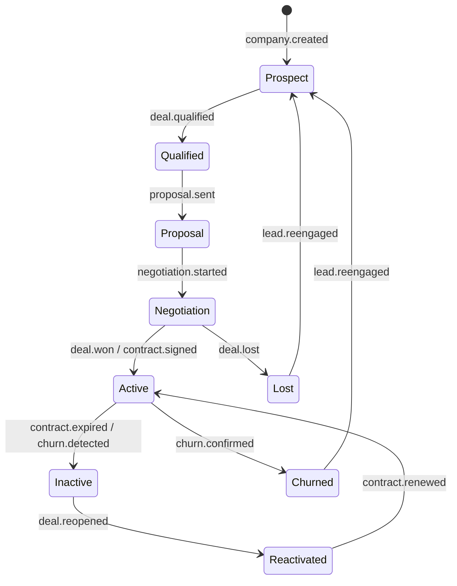
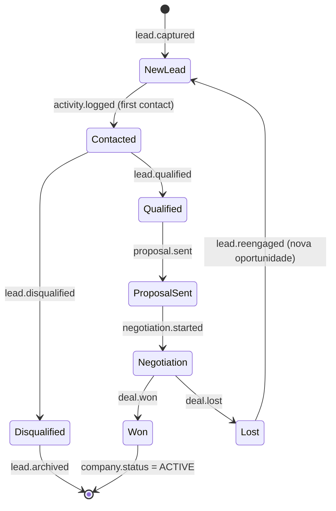

# Customer 360° — Company como Single Source of Truth

> **Versão:** 1.0.0-draft  
> **Volume:** 01 — CRM  
> **Estado:** 📝 Em elaboração  
> **Dependências:** [data-model.md](./data-model.md), [pipeline.md](./pipeline.md), [events.md](./events.md)

---

## 1. Princípio Fundamental

> **A Company é a unidade atómica irredutível do CRM.**

No VD Platform, toda a informação comercial orbita em torno de uma única entidade: a **Empresa (Company)**. Não existe lead sem empresa. Não existe contacto sem empresa. Não existe historial financeiro, operacional ou relacional que não esteja ligado a uma empresa.

Este princípio é chamado **Customer 360°** — a capacidade de ver, num único ecrã, tudo o que a organização sabe sobre um cliente: quem são, onde estão no funil, quem os contactou, o que disseram, o que compraram, quanto devem, quando renovam.

---

## 2. Hierarquia de Entidades

```
Company                    ← TOPO DA HIERARQUIA (SSoT)
│
├── Status                 ← Prospect | Active | Inactive | Churned | Reactivated
├── Pipeline Stage         ← onde está no funil comercial
│
├── Contacts[]             ← pessoas que representam a empresa
│   ├── role               ← Decisor | Utilizador | Técnico | Financeiro | Outro
│   ├── isPrimary          ← contacto principal (1 por empresa)
│   └── communicationLog[] ← historial de comunicações deste contacto
│
├── Employees[]            ← coworkers activos (membros do espaço)
│   ├── plan               ← plano de coworking contratado
│   ├── desk               ← mesa/lugar atribuído
│   └── accessCard         ← cartão de acesso físico
│
├── Deals[]                ← oportunidades comerciais
│   ├── stage              ← Qualification | Proposal | Negotiation | Won | Lost
│   ├── value              ← valor estimado em AOA
│   └── probability        ← % de probabilidade de fecho
│
├── Activities[]           ← interações registadas
│   ├── type               ← Call | Email | Meeting | Demo | Visit | Other
│   ├── direction          ← Inbound | Outbound
│   └── outcome            ← resultado registado
│
├── Tasks[]                ← tarefas pendentes ou concluídas
│   ├── assignedTo         ← utilizador responsável
│   ├── dueDate            ← prazo
│   └── priority           ← Low | Medium | High | Urgent
│
├── Notes[]                ← anotações contextuais
│   ├── content            ← texto livre (suporta Markdown)
│   ├── mentions[]         ← @utilizadores mencionados
│   └── attachments[]      ← ficheiros anexados
│
├── Tags[]                 ← etiquetas de segmentação
│
├── Timeline[]             ← historial cronológico completo (append-only)
│   └── [ver secção 6]
│
├── AuditLog[]             ← auditoria de alterações (append-only)
│
└── Documents[]            ← propostas, contratos, facturas
    ├── proposals[]
    ├── contracts[]
    └── invoices[]
```

---

## 3. Company Lifecycle

A empresa percorre um ciclo de vida completo no sistema. Cada transição de estado é um evento publicado no Event Bus e gera um registo na Timeline.



### Estados da Company

| Estado | Descrição | Pipeline Stage permitido |
|---|---|---|
| `PROSPECT` | Empresa identificada, ainda sem qualificação | New Lead, Contacted, Qualified |
| `QUALIFIED` | Interesse confirmado, proposta em preparação | Qualified, Proposal |
| `NEGOTIATION` | Proposta enviada, em negociação activa | Proposal, Negotiation |
| `ACTIVE` | Contrato assinado, cliente activo | Won |
| `INACTIVE` | Contrato expirado, sem renovação | — |
| `CHURNED` | Cancelamento confirmado | Lost |
| `REACTIVATED` | Cliente inactivo que voltou a contratar | Re-engagement |

---

## 4. Lead Lifecycle

> **Lead não é uma entidade separada — é um estado de uma Company no funil comercial.**

A ideia de "lead" descreve a fase inicial do ciclo de vida de uma empresa no pipeline. Quando uma nova empresa entra no sistema como potencial cliente, ela começa com `status: PROSPECT` e `pipelineStage: NEW_LEAD`.



### Pipeline Stages

| Stage | Código | Descrição | Acções esperadas |
|---|---|---|---|
| Novo Lead | `NEW_LEAD` | Empresa identificada, sem contacto | 1.º contacto em < 24h |
| Contactado | `CONTACTED` | 1.º contacto realizado | Qualificação BANT |
| Qualificado | `QUALIFIED` | Budget, Autoridade, Necessidade, Timing confirmados | Preparar proposta |
| Proposta Enviada | `PROPOSAL_SENT` | Proposta formal enviada | Follow-up em 3 dias |
| Em Negociação | `NEGOTIATION` | Proposta recebida, a negociar termos | Responder dúvidas, fechar |
| Ganho | `WON` | Contrato assinado | Activar empresa, onboarding |
| Perdido | `LOST` | Negócio não concretizado | Registar motivo, nutrir |
| Desqualificado | `DISQUALIFIED` | Não é um cliente adequado | Arquivar, registar motivo |

---

## 5. Contact Management

### Tipos de Contacto

| Tipo | Descrição |
|---|---|
| `DECISION_MAKER` | Responsável pela decisão de compra |
| `USER` | Utilizador final do serviço |
| `TECHNICAL` | Contacto técnico / TI |
| `FINANCIAL` | Responsável financeiro / pagamentos |
| `OTHER` | Outros |

### Regras de Contact Management

1. **Um contacto pertence sempre a uma Company** — não existem contactos "órfãos".
2. **Cada empresa tem exactamente um contacto primário** (`isPrimary: true`).
3. **Um contacto pode existir em múltiplas empresas** (ex.: consultor externo) — a relação é many-to-many através de `CompanyContact`.
4. **A comunicação com um contacto é registada na Timeline da sua Company principal**.
5. **Ao transferir um contacto entre empresas**, o historial permanece na empresa original e é copiado (não movido) para a nova empresa, com nota de auditoria.

---

## 6. Timeline Global

A Timeline é o **registo cronológico imutável** de tudo o que aconteceu com uma empresa. É alimentada exclusivamente pelo Event Bus — nunca escrita directamente.

### Estrutura de uma entrada de Timeline

```typescript
interface TimelineEntry {
  id:          string;           // TL-NNNNNN
  companyId:   string;           // FK obrigatória
  eventType:   TimelineEventType;
  title:       string;           // "Proposta enviada"
  description: string | null;    // detalhe opcional
  metadata:    JsonObject;       // dados específicos do evento
  actorId:     string | null;    // utilizador que causou o evento (null = sistema)
  actorName:   string | null;
  occurredAt:  DateTime;         // timestamp do evento original
  createdAt:   DateTime;         // timestamp de inserção (pode ser posterior)
  isSystem:    boolean;          // true = gerado automaticamente
  linkedEntityType: string | null; // "Deal", "Task", "Note", etc.
  linkedEntityId:   string | null;
}
```

### Tipos de Entrada na Timeline

| Categoria | Eventos |
|---|---|
| **Lead / Pipeline** | Lead capturado, Qualificado, Desqualificado, Proposta enviada, Negociação iniciada, Ganho, Perdido |
| **Actividades** | Chamada registada, Email enviado, Email recebido, Reunião realizada, Demo realizada, Visita ao espaço |
| **Tarefas** | Tarefa criada, Tarefa concluída, Tarefa vencida |
| **Notas** | Nota adicionada, Nota editada |
| **Empresa** | Empresa criada, Dados actualizados, Tags alteradas, Responsável alterado |
| **Contactos** | Contacto adicionado, Contacto removido, Contacto principal alterado |
| **Financeiro** | Proposta gerada, Contrato assinado, Factura emitida, Pagamento recebido, Pagamento em falta |
| **Cowork** | Plano activado, Plano alterado, Contrato renovado, Acesso suspenso, Contrato cancelado |
| **Reservas** | Sala reservada, Reserva cancelada, Check-in, Check-out |
| **Sistema** | Duplicado detectado, Merge realizado, Importação de dados |

---

## 7. Vista Customer 360°

O ecrã Customer 360° é a vista principal de uma empresa no CRM. Agrega em tempo real todos os dados de todos os módulos.

### Estrutura da vista

```
┌─────────────────────────────────────────────────────────┐
│  [Logo]  EMPRESA XYZ LDA                    [ACTIVE] ▼  │
│  NIF: 5001234567  ·  Luanda  ·  Sector: Tecnologia      │
│  Responsável: João Silva  ·  Desde: Mar 2025            │
├──────────────┬──────────────┬──────────────┬────────────┤
│  Pipeline    │  Facturação  │  Actividades │  Tarefas   │
│  NEGOTIATION │  450.000 Kz  │  12 (30d)    │  3 abertas │
├──────────────┴──────────────┴──────────────┴────────────┤
│  CONTACTOS (3)     COWORKERS (2)     DOCUMENTOS (5)     │
│  ► Ana Costa (D)   ► Pedro M.        ► Proposta 001     │
│  ► Rui Neto (U)    ► Sofia L.        ► Contrato 2025    │
│  ► Lara Faria (F)                    ► FT-CWORK-...     │
├─────────────────────────────────────────────────────────┤
│  TIMELINE (ordenada por data, mais recente primeiro)    │
│  Hoje         ● Reunião de negociação — João Silva      │
│  Ontem        ○ Proposta enviada (FT-SALA-2026-000123)  │
│  23 Jul       ● Follow-up realizado por email           │
│  20 Jul       ○ Qualificação confirmada                 │
│  15 Jul       ● Lead capturado via formulário web       │
├─────────────────────────────────────────────────────────┤
│  NOTAS         TAGS              PRÓXIMO FOLLOW-UP      │
│  2 notas       #cowork #tech     29 Jul 2026 — João S.  │
└─────────────────────────────────────────────────────────┘
```

### Secções da Vista Customer 360°

| Secção | Dados exibidos | Fonte |
|---|---|---|
| **Header** | Nome, NIF, localização, sector, estado, responsável, data de criação | Company |
| **KPI Bar** | Stage do pipeline, total facturado, nº actividades (30d), tarefas abertas | Agregação |
| **Contactos** | Lista de contactos com role e contacto principal destacado | Contacts |
| **Coworkers** | Membros activos do espaço com plano contratado | Employees |
| **Documentos** | Propostas, contratos, facturas recentes | Documents |
| **Timeline** | Historial cronológico completo, filtráveis por tipo | Timeline |
| **Notas** | Notas visíveis à equipa, ordenadas por recência | Notes |
| **Tags** | Etiquetas de segmentação | Tags |
| **Follow-up** | Próxima acção agendada e responsável | Tasks |

---

## 8. Regras de Qualidade de Dados

### Detecção de Duplicados

O sistema detecta automaticamente potenciais duplicados com base em:

| Campo | Peso | Lógica |
|---|---|---|
| NIF (fiscal) | Crítico | Exacto — bloqueia criação se já existir |
| Email principal | Alto | Exacto ou domínio igual |
| Nome da empresa | Médio | Similaridade ≥ 85% (Levenshtein) |
| Telefone | Médio | Exacto após normalização |
| Website | Médio | Domínio igual |

**Acção:** Ao detectar potencial duplicado (score ≥ 2 critérios), o sistema alerta o utilizador e sugere o merge antes de criar a nova empresa.

### Regras de Merge

1. A empresa com o registo mais antigo é a **empresa base** (mantém o ID).
2. Todos os Contacts, Activities, Tasks, Notes, Timeline e Documents da empresa duplicada são transferidos para a empresa base.
3. O merge gera um evento `company.merged` no Event Bus.
4. A empresa duplicada é marcada como `MERGED` (não eliminada) com referência à empresa base.
5. Toda a operação de merge é registada em AuditLog com todos os dados transferidos.

---

## 9. Segmentação e Tags

### Tags

- Tags são etiquetas livres atribuídas a uma Company (ex.: `#coworking`, `#tech`, `#premium`, `#angola`).
- Uma company pode ter no máximo 20 tags.
- Tags são normalizadas: lowercase, sem espaços (substituídos por hífen), sem caracteres especiais.
- Tags partilhadas entre companies permitem filtros e segmentação no Dashboard.

### Segmentos Dinâmicos (L3 — futuro)

> Segmentos dinâmicos (filtros salvos automáticos) são uma funcionalidade do Nível L3 e não fazem parte do escopo do Volume 01.

---

## 10. Regras de Negócio CRM (BR-CRM)

| ID | Regra |
|---|---|
| BR-CRM-001 | Toda Company criada recebe automaticamente `stage: NEW_LEAD` e `status: PROSPECT` |
| BR-CRM-002 | A transição para `status: ACTIVE` exige `deal.won` ou `contract.signed` — não pode ser feita manualmente |
| BR-CRM-003 | Não é possível eliminar uma Company com Deals activos, Employees activos ou Facturas em aberto |
| BR-CRM-004 | O responsável (assignedTo) de uma Company deve ser sempre um utilizador `ADMIN` ou `COMERCIAL` |
| BR-CRM-005 | Ao marcar um Deal como `WON`, o sistema actualiza automaticamente `company.status → ACTIVE` |
| BR-CRM-006 | Ao marcar um Deal como `LOST`, o sistema regista o `lostReason` (obrigatório) e mantém a Company em `PROSPECT` para reengagement |
| BR-CRM-007 | Cada empresa só pode ter um Deal no stage `NEGOTIATION` em simultâneo (regra de foco comercial) |
| BR-CRM-008 | O campo NIF é único no sistema — tentativa de duplicar bloqueia com erro 409 |
| BR-CRM-009 | Toda Activity registada gera automaticamente um entry na Timeline da Company associada |
| BR-CRM-010 | Tasks vencidas há mais de 24h sem conclusão geram um evento `task.overdue` e notificação ao responsável |

---

## 11. Integrações com Outros Módulos

| Módulo | Integração | Direcção |
|---|---|---|
| **Financeiro** | Facturas e pagamentos visíveis na Timeline da Company | Financeiro → CRM (via eventos) |
| **Cowork** | Planos activos e coworkers visíveis no Customer 360° | Cowork → CRM (via eventos) |
| **Reservas** | Reservas de sala aparecem na Timeline | Reservas → CRM (via eventos) |
| **Comunicação** | Emails enviados e recebidos registados nas Activities | Comunicação → CRM (via eventos) |
| **Sentry** | Erros críticos no CRM capturados e alertados | CRM → Sentry |

Todas as integrações são **unidireccionais via eventos** — o CRM nunca acede directamente a tabelas de outros módulos.

---

*VD Platform — Customer 360° — v1.0.0-draft — 28 Julho 2026*  
*© 2026 VERSÃO DE NEGÓCIOS - COMÉRCIO GERAL E PRESTAÇÃO DE SERVIÇOS, LDA. Confidencial.*
