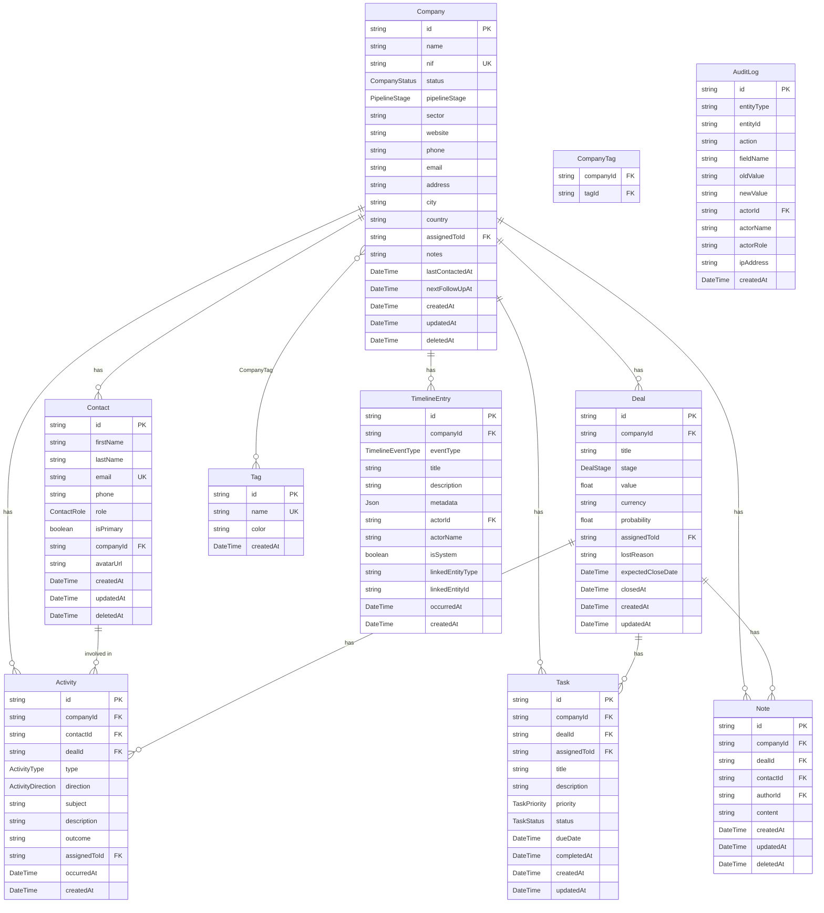

# CRM — Modelo de Dados

> **Versão:** 1.0.0-draft  
> **Volume:** 01 — CRM  
> **Estado:** 📝 Em elaboração  
> **Dependências:** [customer360.md](./customer360.md)  
> **Impacto:** Schema Prisma · Migrações · API Routes · Testes  
> ⚠️ Requer aprovação formal antes de qualquer `prisma migrate dev`

---

## 1. Princípios do Modelo de Dados

1. **Company como raiz** — toda FK relevante aponta para `Company`.
2. **Append-only para auditoria** — `Timeline` e `AuditLog` nunca são modificadas, apenas acrescentadas.
3. **Soft delete** — entidades críticas usam `deletedAt: DateTime?` em vez de eliminação física.
4. **Enums no schema** — todos os estados são enum Prisma, nunca strings livres.
5. **Timestamps obrigatórios** — `createdAt` e `updatedAt` em todas as tabelas.
6. **Índices explícitos** — performance por design, não por acidente.
7. **Uma transacção = uma unidade de negócio** — toda operação multi-tabela usa `prisma.$transaction()`.

---

## 2. Diagrama ERD



---

## 3. Schema Prisma Proposto

```prisma
// ============================================================
// ENUMS — CRM
// ============================================================

enum CompanyStatus {
  PROSPECT
  QUALIFIED
  NEGOTIATION
  ACTIVE
  INACTIVE
  CHURNED
  REACTIVATED
  MERGED
}

enum PipelineStage {
  NEW_LEAD
  CONTACTED
  QUALIFIED
  PROPOSAL_SENT
  NEGOTIATION
  WON
  LOST
  DISQUALIFIED
}

enum DealStage {
  QUALIFICATION
  PROPOSAL
  NEGOTIATION
  WON
  LOST
}

enum ContactRole {
  DECISION_MAKER
  USER
  TECHNICAL
  FINANCIAL
  OTHER
}

enum ActivityType {
  CALL
  EMAIL
  MEETING
  DEMO
  VISIT
  WHATSAPP
  NOTE_CALL
  OTHER
}

enum ActivityDirection {
  INBOUND
  OUTBOUND
}

enum TaskPriority {
  LOW
  MEDIUM
  HIGH
  URGENT
}

enum TaskStatus {
  OPEN
  IN_PROGRESS
  DONE
  CANCELLED
}

enum TimelineEventType {
  // Lead / Pipeline
  LEAD_CAPTURED
  LEAD_QUALIFIED
  LEAD_DISQUALIFIED
  LEAD_REENGAGED
  DEAL_CREATED
  DEAL_STAGE_CHANGED
  DEAL_WON
  DEAL_LOST
  PROPOSAL_SENT
  NEGOTIATION_STARTED
  // Actividades
  CALL_LOGGED
  EMAIL_SENT
  EMAIL_RECEIVED
  MEETING_HELD
  DEMO_HELD
  VISIT_LOGGED
  // Tarefas
  TASK_CREATED
  TASK_COMPLETED
  TASK_OVERDUE
  // Notas
  NOTE_ADDED
  NOTE_EDITED
  // Empresa
  COMPANY_CREATED
  COMPANY_UPDATED
  COMPANY_STATUS_CHANGED
  COMPANY_MERGED
  OWNER_CHANGED
  // Contactos
  CONTACT_ADDED
  CONTACT_REMOVED
  PRIMARY_CONTACT_CHANGED
  // Financeiro (via eventos externos)
  INVOICE_ISSUED
  PAYMENT_RECEIVED
  PAYMENT_OVERDUE
  CONTRACT_SIGNED
  CONTRACT_RENEWED
  CONTRACT_CANCELLED
  // Cowork (via eventos externos)
  PLAN_ACTIVATED
  PLAN_CHANGED
  ACCESS_SUSPENDED
  // Reservas (via eventos externos)
  ROOM_BOOKED
  BOOKING_CANCELLED
  CHECKIN
  CHECKOUT
  // Sistema
  DUPLICATE_DETECTED
  MERGE_PERFORMED
  DATA_IMPORTED
}

// ============================================================
// MODELS — CRM
// ============================================================

model Company {
  id             String        @id @default(cuid())
  name           String
  nif            String?       @unique
  status         CompanyStatus @default(PROSPECT)
  pipelineStage  PipelineStage @default(NEW_LEAD)
  sector         String?
  website        String?
  phone          String?
  email          String?
  address        String?
  city           String?
  country        String        @default("Angola")
  assignedToId   String?
  assignedTo     Admin?        @relation("CompanyAssignee", fields: [assignedToId], references: [id])
  internalNotes  String?
  lastContactedAt DateTime?
  nextFollowUpAt  DateTime?
  mergedIntoId   String?       // se MERGED, aponta para a empresa base
  
  // Relações
  contacts       Contact[]
  deals          Deal[]
  activities     Activity[]
  tasks          Task[]
  notes          Note[]
  tags           CompanyTag[]
  timeline       TimelineEntry[]
  
  createdAt      DateTime      @default(now())
  updatedAt      DateTime      @updatedAt
  deletedAt      DateTime?

  @@index([status])
  @@index([pipelineStage])
  @@index([assignedToId])
  @@index([nif])
  @@index([deletedAt])
  @@map("companies")
}

model Contact {
  id          String      @id @default(cuid())
  firstName   String
  lastName    String
  email       String?
  phone       String?
  role        ContactRole @default(OTHER)
  isPrimary   Boolean     @default(false)
  avatarUrl   String?
  companyId   String
  company     Company     @relation(fields: [companyId], references: [id])
  activities  Activity[]
  notes       Note[]
  
  createdAt   DateTime    @default(now())
  updatedAt   DateTime    @updatedAt
  deletedAt   DateTime?

  @@unique([email, companyId])
  @@index([companyId])
  @@index([isPrimary])
  @@map("contacts")
}

model Deal {
  id                 String    @id @default(cuid())
  companyId          String
  company            Company   @relation(fields: [companyId], references: [id])
  title              String
  stage              DealStage @default(QUALIFICATION)
  value              Float     @default(0)
  currency           String    @default("AOA")
  probability        Float     @default(0)   // 0–100
  assignedToId       String?
  assignedTo         Admin?    @relation("DealAssignee", fields: [assignedToId], references: [id])
  lostReason         String?
  expectedCloseDate  DateTime?
  closedAt           DateTime?
  activities         Activity[]
  tasks              Task[]
  notes              Note[]
  
  createdAt          DateTime  @default(now())
  updatedAt          DateTime  @updatedAt

  @@index([companyId])
  @@index([stage])
  @@index([assignedToId])
  @@map("deals")
}

model Activity {
  id           String            @id @default(cuid())
  companyId    String
  company      Company           @relation(fields: [companyId], references: [id])
  contactId    String?
  contact      Contact?          @relation(fields: [contactId], references: [id])
  dealId       String?
  deal         Deal?             @relation(fields: [dealId], references: [id])
  type         ActivityType
  direction    ActivityDirection @default(OUTBOUND)
  subject      String
  description  String?
  outcome      String?
  assignedToId String?
  assignedTo   Admin?            @relation("ActivityOwner", fields: [assignedToId], references: [id])
  occurredAt   DateTime          @default(now())
  
  createdAt    DateTime          @default(now())

  @@index([companyId])
  @@index([dealId])
  @@index([occurredAt])
  @@map("activities")
}

model Task {
  id           String       @id @default(cuid())
  companyId    String
  company      Company      @relation(fields: [companyId], references: [id])
  dealId       String?
  deal         Deal?        @relation(fields: [dealId], references: [id])
  assignedToId String?
  assignedTo   Admin?       @relation("TaskAssignee", fields: [assignedToId], references: [id])
  title        String
  description  String?
  priority     TaskPriority @default(MEDIUM)
  status       TaskStatus   @default(OPEN)
  dueDate      DateTime?
  completedAt  DateTime?
  
  createdAt    DateTime     @default(now())
  updatedAt    DateTime     @updatedAt

  @@index([companyId])
  @@index([assignedToId])
  @@index([status])
  @@index([dueDate])
  @@map("tasks")
}

model Note {
  id         String   @id @default(cuid())
  companyId  String
  company    Company  @relation(fields: [companyId], references: [id])
  dealId     String?
  deal       Deal?    @relation(fields: [dealId], references: [id])
  contactId  String?
  contact    Contact? @relation(fields: [contactId], references: [id])
  authorId   String
  author     Admin    @relation("NoteAuthor", fields: [authorId], references: [id])
  content    String   // Markdown
  
  createdAt  DateTime @default(now())
  updatedAt  DateTime @updatedAt
  deletedAt  DateTime?

  @@index([companyId])
  @@index([authorId])
  @@map("notes")
}

model Tag {
  id        String       @id @default(cuid())
  name      String       @unique
  color     String       @default("#6366f1")
  companies CompanyTag[]
  
  createdAt DateTime     @default(now())

  @@map("tags")
}

model CompanyTag {
  companyId String
  company   Company  @relation(fields: [companyId], references: [id])
  tagId     String
  tag       Tag      @relation(fields: [tagId], references: [id])
  createdAt DateTime @default(now())

  @@id([companyId, tagId])
  @@map("company_tags")
}

model TimelineEntry {
  id               String             @id @default(cuid())
  companyId        String
  company          Company            @relation(fields: [companyId], references: [id])
  eventType        TimelineEventType
  title            String
  description      String?
  metadata         Json               @default("{}")
  actorId          String?
  actorName        String?
  isSystem         Boolean            @default(false)
  linkedEntityType String?
  linkedEntityId   String?
  occurredAt       DateTime
  
  createdAt        DateTime           @default(now())

  @@index([companyId, occurredAt(sort: Desc)])
  @@index([eventType])
  @@map("timeline_entries")
}

model AuditLog {
  id         String   @id @default(cuid())
  entityType String
  entityId   String
  action     String   // CREATE | UPDATE | DELETE | MERGE
  fieldName  String?
  oldValue   String?
  newValue   String?
  actorId    String?
  actorName  String?
  actorRole  String?
  ipAddress  String?
  
  createdAt  DateTime @default(now())

  @@index([entityType, entityId])
  @@index([actorId])
  @@index([createdAt])
  @@map("audit_logs")
}
```

---

## 4. Campos Calculados (não persistidos)

Estes campos são calculados em runtime pela API e não existem na base de dados:

| Campo | Entidade | Cálculo |
|---|---|---|
| `fullName` | Contact | `firstName + " " + lastName` |
| `daysSinceLastContact` | Company | `now() - lastContactedAt` (em dias) |
| `isOverdue` | Task | `status !== DONE && dueDate < now()` |
| `totalPipelineValue` | Dashboard | `SUM(deals.value WHERE stage NOT IN [WON, LOST])` |
| `conversionRate` | Dashboard | `COUNT(WON) / COUNT(WON + LOST) * 100` |
| `avgDealCycleTime` | Dashboard | `AVG(closedAt - createdAt) WHERE stage = WON` |

---

## 5. Índices de Performance

### Índices críticos (obrigatórios antes do go-live)

```sql
-- Pesquisa de companies por nome (full-text)
CREATE INDEX idx_companies_name_fts ON companies USING gin(to_tsvector('portuguese', name));

-- Pipeline view (stage + assignee)
CREATE INDEX idx_companies_stage_assignee ON companies(pipeline_stage, assigned_to_id) WHERE deleted_at IS NULL;

-- Timeline ordenada por empresa (query mais frequente)
CREATE INDEX idx_timeline_company_occurred ON timeline_entries(company_id, occurred_at DESC);

-- Tasks vencidas (job de notificação)
CREATE INDEX idx_tasks_overdue ON tasks(due_date) WHERE status IN ('OPEN', 'IN_PROGRESS') AND due_date IS NOT NULL;

-- Detecção de duplicados por NIF
CREATE UNIQUE INDEX idx_companies_nif ON companies(nif) WHERE nif IS NOT NULL AND deleted_at IS NULL;
```

---

## 6. Regras de Integridade

| Regra | Nível | Descrição |
|---|---|---|
| FK obrigatória | DB | `companyId` não pode ser NULL em nenhuma entidade dependente |
| NIF único | DB | Índice único parcial (exclui NULL e deleted) |
| Email único por empresa | DB | `@@unique([email, companyId])` em Contact |
| Um primary contact | App | Verificado em código antes de `isPrimary: true` |
| Max 1 Deal em NEGOTIATION | App | Verificado em código (BR-CRM-007) |
| Soft delete apenas | App | `deletedAt` em vez de DELETE — verificado em todos os queries |
| Timeline append-only | App | Sem UPDATE ou DELETE em `timeline_entries` |
| AuditLog append-only | App | Sem UPDATE ou DELETE em `audit_logs` |

---

## 7. Estratégia de Migração

Ver documento completo: [migration.md](./migration.md)

### Sumário das migrações necessárias

```
Migration 001: Create companies table
Migration 002: Create contacts table  
Migration 003: Create deals table
Migration 004: Create activities table
Migration 005: Create tasks table
Migration 006: Create notes table
Migration 007: Create tags + company_tags tables
Migration 008: Create timeline_entries table
Migration 009: Create audit_logs table
Migration 010: Migrate existing Lead data → companies + deals
Migration 011: Add full-text search index
Migration 012: Add performance indexes
```

Todas as migrações são **reversíveis** e foram testadas contra os dados reais da base de dados antes da aprovação.

---

## 8. Considerações de Segurança

1. **`nif` e dados PII** — campos sensíveis não incluídos em logs de debugging.
2. **`AuditLog.oldValue` e `newValue`** — valores de campos sensíveis são mascarados (ex.: `"***"`) para campos marcados como PII.
3. **Soft delete** — garante que dados nunca são perdidos acidentalmente; recuperação possível pelo administrador.
4. **Row-level security** — futuro (L3): cada utilizador só vê as companies `assignedToId === session.userId` (excepto ADMIN).

---

*VD Platform — CRM Data Model — v1.0.0-draft — 28 Julho 2026*  
*© 2026 VERSÃO DE NEGÓCIOS - COMÉRCIO GERAL E PRESTAÇÃO DE SERVIÇOS, LDA. Confidencial.*
