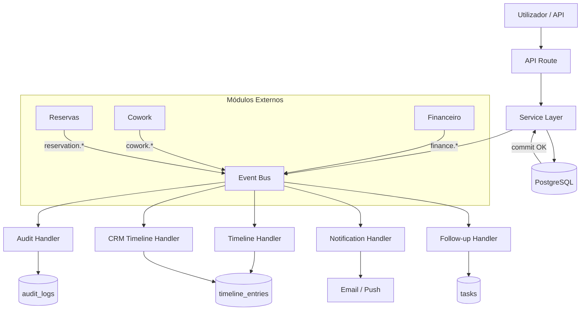

# CRM — Event Catalog

> **Versão:** 1.0.0-draft  
> **Volume:** 01 — CRM  
> **Estado:** 📝 Em elaboração  
> **Dependências:** [customer360.md](./customer360.md), [data-model.md](./data-model.md)

---

## 1. Princípios do Event Bus no CRM

1. **Toda acção de negócio relevante gera um evento** — sem excepções.
2. **Eventos são publicados após persistência** — nunca antes. A transacção confirma primeiro, o evento é publicado depois.
3. **Eventos são imutáveis** — uma vez publicados, nunca são modificados.
4. **A Timeline é alimentada exclusivamente por eventos** — nenhum código escreve directamente na `timeline_entries`.
5. **Eventos externos (Financeiro, Cowork, Reservas) chegam ao CRM e geram entradas na Timeline** — o CRM consome eventos de outros módulos.
6. **Idempotência** — handlers devem suportar reprocessamento seguro (evento duplicado não causa efeitos duplos).

---

## 2. Nomenclatura

```
{domínio}.{entidade}.{acção}

Exemplos:
  crm.company.created
  crm.deal.won
  crm.task.overdue
  finance.invoice.issued       ← evento externo consumido pelo CRM
  cowork.contract.renewed      ← evento externo consumido pelo CRM
```

---

## 3. Catálogo de Eventos CRM (publicados pelo CRM)

### 3.1 Company Events

| Evento | Trigger | Timeline Entry | Notificação |
|---|---|---|---|
| `crm.company.created` | Nova empresa criada | ✅ "Empresa adicionada ao CRM" | — |
| `crm.company.updated` | Dados da empresa alterados | ✅ "Dados actualizados" (campos alterados) | — |
| `crm.company.statusChanged` | `status` alterado | ✅ "Estado alterado: X → Y" | ADMIN |
| `crm.company.ownerChanged` | `assignedToId` alterado | ✅ "Responsável alterado para [nome]" | novo owner |
| `crm.company.merged` | Empresa merged com outra | ✅ "Empresa fundida com [nome]" | ADMIN |
| `crm.company.deleted` | Empresa soft-deleted | ✅ "Empresa arquivada" | ADMIN |
| `crm.company.tagAdded` | Tag adicionada | ✅ "Tag #[nome] adicionada" | — |
| `crm.company.tagRemoved` | Tag removida | ✅ "Tag #[nome] removida" | — |

**Payload `crm.company.created`:**
```typescript
{
  eventType: "crm.company.created",
  companyId: string,
  companyName: string,
  createdBy: { id: string, name: string, role: AdminRole },
  source: "MANUAL" | "IMPORT" | "FORM" | "API",
  timestamp: ISO8601
}
```

**Payload `crm.company.statusChanged`:**
```typescript
{
  eventType: "crm.company.statusChanged",
  companyId: string,
  companyName: string,
  previousStatus: CompanyStatus,
  newStatus: CompanyStatus,
  changedBy: { id: string, name: string },
  reason: string | null,
  timestamp: ISO8601
}
```

---

### 3.2 Lead / Pipeline Events

| Evento | Trigger | Timeline Entry | Notificação |
|---|---|---|---|
| `crm.lead.captured` | Company criada com origem lead | ✅ "Lead capturado" | COMERCIAL assignado |
| `crm.lead.contacted` | Primeira Activity registada | ✅ "1.º contacto realizado" | — |
| `crm.lead.qualified` | Stage → QUALIFIED | ✅ "Lead qualificado" | ADMIN |
| `crm.lead.disqualified` | Stage → DISQUALIFIED | ✅ "Lead desqualificado: [motivo]" | — |
| `crm.lead.reengaged` | Stage LOST → NEW_LEAD | ✅ "Re-engagement iniciado" | COMERCIAL assignado |
| `crm.deal.created` | Novo Deal criado | ✅ "Oportunidade criada: [título]" | — |
| `crm.deal.stageChanged` | Deal stage alterado | ✅ "Pipeline: [stage anterior] → [novo stage]" | — |
| `crm.deal.won` | Deal fechado como WON | ✅ "🎉 Negócio ganho! [valor] AOA" | ADMIN + COMERCIAL |
| `crm.deal.lost` | Deal fechado como LOST | ✅ "Negócio perdido: [motivo]" | ADMIN |
| `crm.proposal.sent` | Proposta enviada | ✅ "Proposta enviada ao cliente" | — |
| `crm.negotiation.started` | Stage → NEGOTIATION | ✅ "Negociação iniciada" | ADMIN |

**Payload `crm.deal.won`:**
```typescript
{
  eventType: "crm.deal.won",
  companyId: string,
  companyName: string,
  dealId: string,
  dealTitle: string,
  value: number,
  currency: "AOA",
  closedBy: { id: string, name: string },
  cycleTimeDays: number,      // dias desde deal.createdAt
  timestamp: ISO8601
}
```

**Payload `crm.deal.lost`:**
```typescript
{
  eventType: "crm.deal.lost",
  companyId: string,
  dealId: string,
  dealTitle: string,
  value: number,
  lostReason: LostReason,
  lostBy: { id: string, name: string },
  cycleTimeDays: number,
  timestamp: ISO8601
}
```

---

### 3.3 Activity Events

| Evento | Trigger | Timeline Entry | Notificação |
|---|---|---|---|
| `crm.activity.logged` | Qualquer Activity criada | ✅ "[tipo]: [subject]" | — |
| `crm.call.logged` | Activity tipo CALL | ✅ "Chamada: [subject] — [outcome]" | — |
| `crm.email.sent` | Activity tipo EMAIL + OUTBOUND | ✅ "Email enviado: [subject]" | — |
| `crm.email.received` | Activity tipo EMAIL + INBOUND | ✅ "Email recebido: [subject]" | COMERCIAL assignado |
| `crm.meeting.held` | Activity tipo MEETING | ✅ "Reunião: [subject] — [outcome]" | — |
| `crm.demo.held` | Activity tipo DEMO | ✅ "Demo realizada: [outcome]" | — |
| `crm.visit.logged` | Activity tipo VISIT | ✅ "Visita ao espaço registada" | — |

**Payload `crm.activity.logged`:**
```typescript
{
  eventType: "crm.activity.logged",
  companyId: string,
  contactId: string | null,
  dealId: string | null,
  activityId: string,
  type: ActivityType,
  direction: ActivityDirection,
  subject: string,
  outcome: string | null,
  loggedBy: { id: string, name: string },
  occurredAt: ISO8601,
  timestamp: ISO8601
}
```

---

### 3.4 Task Events

| Evento | Trigger | Timeline Entry | Notificação |
|---|---|---|---|
| `crm.task.created` | Nova Task criada | ✅ "Tarefa criada: [título]" | assignedTo |
| `crm.task.completed` | Task → DONE | ✅ "Tarefa concluída: [título]" | — |
| `crm.task.overdue` | Task vencida (job nocturno) | ✅ "⚠️ Tarefa vencida: [título]" | assignedTo + ADMIN |
| `crm.task.cancelled` | Task → CANCELLED | ✅ "Tarefa cancelada: [título]" | — |
| `crm.task.reassigned` | `assignedToId` alterado | ✅ "Tarefa reatribuída a [nome]" | novo assignedTo |
| `crm.followup.due` | `company.nextFollowUpAt` atingido | ✅ "Follow-up agendado" | assignedTo |

**Payload `crm.task.overdue`:**
```typescript
{
  eventType: "crm.task.overdue",
  companyId: string,
  taskId: string,
  taskTitle: string,
  dueDate: ISO8601,
  assignedTo: { id: string, name: string, email: string },
  hoursOverdue: number,
  timestamp: ISO8601
}
```

---

### 3.5 Note Events

| Evento | Trigger | Timeline Entry | Notificação |
|---|---|---|---|
| `crm.note.added` | Nova Nota criada | ✅ "Nota adicionada por [autor]" | utilizadores mencionados |
| `crm.note.edited` | Nota editada | ✅ "Nota editada" | — |
| `crm.note.deleted` | Nota soft-deleted | — (sem entrada na Timeline) | — |

---

### 3.6 Contact Events

| Evento | Trigger | Timeline Entry | Notificação |
|---|---|---|---|
| `crm.contact.added` | Contact adicionado à empresa | ✅ "Contacto adicionado: [nome] ([role])" | — |
| `crm.contact.removed` | Contact removido da empresa | ✅ "Contacto removido: [nome]" | — |
| `crm.contact.primaryChanged` | `isPrimary` alterado | ✅ "Contacto principal: [nome]" | — |
| `crm.contact.updated` | Dados de contacto alterados | — (sem Timeline, apenas AuditLog) | — |

---

## 4. Eventos Externos Consumidos pelo CRM

Estes eventos são publicados por outros módulos e o CRM os consome para enriquecer a Timeline.

### 4.1 Eventos do Módulo Financeiro

| Evento externo | Timeline Entry gerada |
|---|---|
| `finance.invoice.issued` | "💰 Factura emitida: [número] — [valor] AOA" |
| `finance.payment.received` | "✅ Pagamento recebido: [valor] AOA — [método]" |
| `finance.payment.overdue` | "⚠️ Pagamento em falta: [valor] AOA (venceu há [N] dias)" |
| `finance.contract.signed` | "📄 Contrato assinado: [número]" |

### 4.2 Eventos do Módulo Cowork

| Evento externo | Timeline Entry gerada |
|---|---|
| `cowork.plan.activated` | "🏢 Plano de coworking activado: [plano]" |
| `cowork.plan.changed` | "🏢 Plano alterado: [plano anterior] → [novo plano]" |
| `cowork.contract.renewed` | "🔄 Contrato renovado até [data]" |
| `cowork.access.suspended` | "⛔ Acesso suspenso: [motivo]" |
| `cowork.contract.cancelled` | "❌ Contrato cancelado: [motivo]" |

### 4.3 Eventos do Módulo Reservas

| Evento externo | Timeline Entry gerada |
|---|---|
| `reservation.created` | "📅 Sala reservada: [sala] — [data] [hora]" |
| `reservation.cancelled` | "❌ Reserva cancelada: [sala] — [data]" |
| `reservation.checkin` | "✅ Check-in: [sala]" |
| `reservation.checkout` | "🚪 Check-out: [sala]" |

---

## 5. Diagrama de Fluxo de Eventos



---

## 6. Handlers CRM

### Timeline Handler

```typescript
// src/lib/crm-event-handlers.ts

export async function handleCrmEvent(event: CrmEvent, tx: DbClient): Promise<void> {
  const entry = mapEventToTimelineEntry(event);
  if (!entry) return; // evento não gera Timeline

  await tx.timelineEntry.create({ data: entry });
}

function mapEventToTimelineEntry(event: CrmEvent): TimelineEntryCreateInput | null {
  switch (event.eventType) {
    case "crm.company.created":
      return {
        companyId:   event.companyId,
        eventType:   "COMPANY_CREATED",
        title:       "Empresa adicionada ao CRM",
        isSystem:    false,
        actorId:     event.createdBy.id,
        actorName:   event.createdBy.name,
        occurredAt:  event.timestamp,
        metadata:    { source: event.source },
      };
    case "crm.deal.won":
      return {
        companyId:   event.companyId,
        eventType:   "DEAL_WON",
        title:       `Negócio ganho: ${formatCurrency(event.value, event.currency)}`,
        isSystem:    false,
        actorId:     event.closedBy.id,
        actorName:   event.closedBy.name,
        occurredAt:  event.timestamp,
        linkedEntityType: "Deal",
        linkedEntityId:   event.dealId,
        metadata:    { value: event.value, cycleTimeDays: event.cycleTimeDays },
      };
    // ... restantes casos
    default:
      return null;
  }
}
```

### Follow-up Auto-creation Handler

```typescript
export async function handleFollowUpTrigger(
  event: CrmEvent,
  tx: DbClient
): Promise<void> {
  if (event.eventType !== "crm.proposal.sent") return;

  // Criar task de follow-up automático em 3 dias
  await tx.task.create({
    data: {
      companyId:   event.companyId,
      title:       `Follow-up proposta — ${event.companyName}`,
      priority:    "MEDIUM",
      status:      "OPEN",
      dueDate:     addDays(new Date(), 3),
      assignedToId: event.sentBy.id,
    },
  });
}
```

---

## 7. Job de Detecção de Tarefas Vencidas

```typescript
// Executado diariamente às 08:00 (Africa/Luanda)
export async function checkOverdueTasks(db: DbClient): Promise<void> {
  const overdueTasks = await db.task.findMany({
    where: {
      status: { in: ["OPEN", "IN_PROGRESS"] },
      dueDate: { lt: new Date() },
    },
    include: { company: true, assignedTo: true },
  });

  for (const task of overdueTasks) {
    await db.$transaction(async (tx) => {
      // Publicar evento
      await publishEvent({
        eventType: "crm.task.overdue",
        companyId: task.companyId,
        taskId: task.id,
        taskTitle: task.title,
        dueDate: task.dueDate!.toISOString(),
        assignedTo: {
          id: task.assignedTo!.id,
          name: task.assignedTo!.name,
          email: task.assignedTo!.email,
        },
        hoursOverdue: differenceInHours(new Date(), task.dueDate!),
        timestamp: new Date().toISOString(),
      }, tx);
    });
  }
}
```

---

*VD Platform — CRM Event Catalog — v1.0.0-draft — 28 Julho 2026*  
*© 2026 VERSÃO DE NEGÓCIOS - COMÉRCIO GERAL E PRESTAÇÃO DE SERVIÇOS, LDA. Confidencial.*
